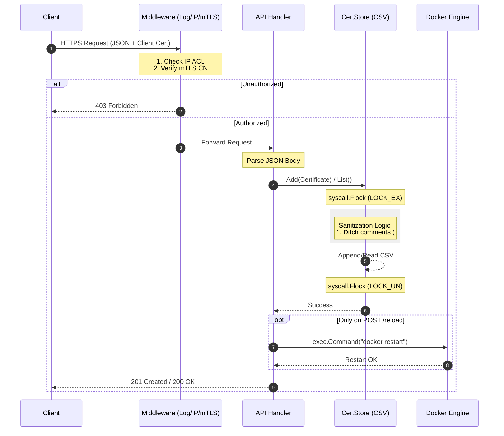
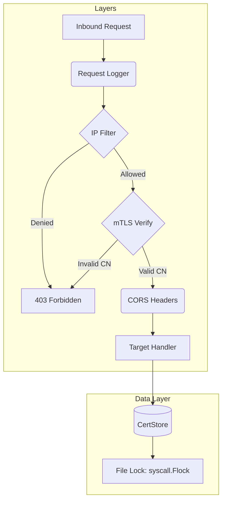

# Cert Manager API (Secure mTLS Gateway)

A high-performance, hardened Go-based API designed to automate **Certbot** certificate management through a secure, identity-verified gateway.

## 🛡️ Security Architecture

The application follows the **"Security Onion"** model (Chain of Responsibility pattern). Every request must pass through multiple layers of validation before touching the data layer or triggering system commands.

### Request Lifecycle

Code snippet



## 🚀 Key Features

- **Identity-Based Access (mTLS):** Requires valid client certificates signed by a Private CA.
- **Common Name (CN) Pinning:** Authorization is restricted to a specific list of approved certificate identities.
- **Dual-Layer Locking:** * **Thread-Safety:** `sync.RWMutex` for high-concurrency memory safety.
  - **Process-Safety:** `syscall.Flock` (exclusive locking) to prevent CSV corruption across different OS processes.
- **Hardened Build:** Pre-configured for `garble` obfuscation and symbol stripping.
- **Modern CLI:** A "UV-inspired" help menu with ANSI color support and automated pipe detection.

------

## 🛠️ Technical Design Patterns

### 1. Repository Pattern (Data Layer)

The `CertStore` abstracts all file I/O. The rest of the application interacts only with high-level methods (`List`, `Add`), making it trivial to swap the CSV backend for a SQL database in the future.

### 2. Strategy Pattern (ACL Enforcement)

The `IPFilter` implements a strategy based on the `-mode` flag. It dynamically toggles between **Default Deny** (Whitelisting) and **Default Allow** (Blacklisting) without requiring code changes.

### 3. Middleware "Onion"

The application uses a nested middleware chain to ensure that logging always occurs first, followed by network-level security, then identity-level security.

Code snippet



------

## 📦 Installation & Build

### Prerequisites

- Go 1.25+ (Required for `garble` compatibility)
- `mvdan.cc/garble` for obfuscation
- Docker (for the `reload` endpoint)

### Hardened Production Build

To generate a production binary stripped of all debug symbols and local paths:

Bash

```bash
# Initialize and fetch dependencies
go mod init cert-manager
go get github.com/mattn/go-isatty

# Build with Garble (Obfuscated)
GOOS=linux GOARCH=amd64 garble -literals -tiny build -trimpath -ldflags "-s -w" -o cert-api .
```

------

## 🚦 Usage

### Command Line Flags

| **Flag**   | **Default**   | **Description**                         |
| ---------- | ------------- | --------------------------------------- |
| `-addr`    | `:443`        | HTTPS server address                    |
| `-cert`    | `server.crt`  | Path to TLS certificate                 |
| `-key`     | `server.key`  | Path to TLS private key                 |
| `-ca`      | `ca.crt`      | Path to **Private CA** for mTLS         |
| `-clients` | `clients.txt` | List of authorized mTLS Common Names    |
| `-acl`     | `ips.txt`     | List of allowed/denied IPs              |
| `-mode`    | `allow`       | ACL enforcement mode (`allow` | `deny`) |
| `-csv`     | `certs.csv`   | Path to the persistence file            |

### Example

Bash

```
./cert-api -mode deny -ca ./pki/ca.crt -clients ./pki/authorized.txt
```

------

## 🧪 API Endpoints

| **Method** | **Endpoint**   | **Description**                           |
| ---------- | -------------- | ----------------------------------------- |
| `GET`      | `/healthcheck` | Returns system status (Bypasses mTLS/ACL) |
| `GET`      | `/certs`       | Returns all registered FQDNs in JSON      |
| `POST`     | `/certs`       | Registers a new certificate to the store  |
| `POST`     | `/reload`      | Restarts the Certbot Docker container     |

------


### How to move away from `root` (The Professional Way)

If you want to harden this for a production environment, follow these three steps:

#### Step A: Create a Dedicated Service User

Don't run the app as "Daniel" or "root." Create a system user with no login shell.

Bash

```
sudo useradd -r -s /usr/sbin/nologin certapi
```

#### Step B: Grant Docker Access Without Root

Add that user to the `docker` group so it can run `docker restart` without needing `sudo`.

Bash

```
sudo usermod -aG docker certapi
```

#### Step C: Set Permissions on the CSV

Ensure the new user owns the data it needs to write to.

Bash

```
sudo chown certapi:certapi certificates.csv
```

------

### 

Configure System Level...

```bash
cat << EOF > /etc/systemd/system/cert-api.service
[Unit]
Description=Certbot Manager API
After=docker.service

[Service]
# Use the full path and include the target container name
ExecStart=/usr/local/bin/cert-api -cert-manager="certbot"
Restart=always
User=certapi
Group=docker
# AmbientCapabilities allows binding to :443 if ever needed without root
AmbientCapabilities=CAP_NET_BIND_SERVICE
# Run as root or a user in the docker group

[Install]
WantedBy=multi-user.target
EOF
```


## 📝 License

Proprietary / Internal Use Only

**Author:** Daniel Cruz